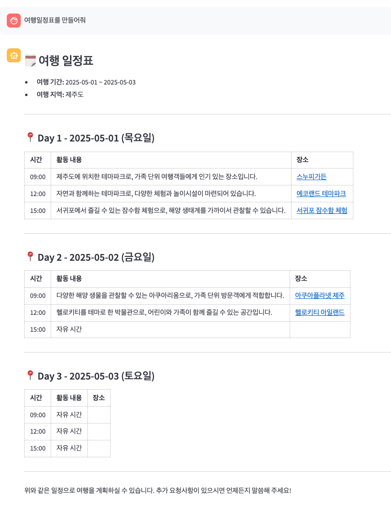

# 여행 일정 도우미

대화형 인터페이스를 통해 여행 장소를 검색하고 여행 일정을 생성할 수 있는 애플리케이션입니다.

## 기능

-   대화형 인터페이스로 자연스러운 여행 일정 계획
-   여행지 검색 및 추천
-   일정 생성 및 최적화
-   여행 일정 캘린더 반영 및 이메일 공유 기능

## 기술 스택

### 백엔드

-   FastAPI: API 서버
-   LangGraph: AI 에이전트 오케스트레이션
-   LangChain: 대규모 언어 모델(LLM) 애플리케이션 프레임워크
-   OpenAI: 자연어 처리 및 생성 AI

### 프론트엔드

-   Streamlit: 대화형 데이터 애플리케이션 구축 프레임워크

## 설치 및 실행

### 1. 저장소 클론

```bash
git clone https://github.com/papooo-dev/travel-planner-agents.git
cd travel-planner-agents
```

### 2. uv 설치

```bash
# macOS/Linux
curl -LsSf https://astral.sh/uv/install.sh | sh

# Windows (PowerShell)
irm https://astral.sh/uv/install.ps1 | iex
```

### 3. 환경 변수 설정

-   `.env.sample` 파일을 복사하여 `.env` 파일을 만들고, 필요한 API 키 및 설정 값을 채워넣으세요

- **Google API 연동 및 필수 환경 변수**

이 애플리케이션은 **Google Calendar API**와 **Gmail API**를 사용해 일정을 캘린더에 반영하고 메일로 공유합니다.
 로컬 / 서버 어디에서 실행하든 **OAuth 2.0** 사용자 인증이 한 번 필요하며, 이후에는 `token.json`이 자동으로 재사용됩니다.

1. **Google Cloud 프로젝트 생성**
   1. Google Cloud 콘솔 → **프로젝트 만들기**
   2. 새 프로젝트 선택 후 **APIs & Services > Dashboard**로 이동.
2. **API 활성화**
   - **Google Calendar API**
   - **Gmail API**
      각각 **Enable API** 버튼을 눌러 활성화합니다. [Google for Developers](https://developers.google.com/workspace/calendar/api/quickstart/python?utm_source=chatgpt.com)[Google for Developers](https://developers.google.com/workspace/gmail/api/quickstart/python?utm_source=chatgpt.com)
3. **OAuth 동의 화면 구성**
   1. **APIs & Services > OAuth consent screen**
   2. **User Type** → **External** 선택 → 앱 이름·지원 이메일 입력 후 저장.
   3. 테스트 사용자를 추가(본인 Gmail). [Google AI for Developers](https://ai.google.dev/palm_docs/oauth_quickstart?utm_source=chatgpt.com)[martinheinz.dev](https://martinheinz.dev/blog/84?utm_source=chatgpt.com)
4. **OAuth 클라이언트 ID 생성**
   1. **APIs & Services > Credentials > Create credentials > OAuth client ID**
   2. **Application type** → **Desktop app** 선택.
   3. 생성이 끝나면 `credentials.json` 파일을 다운로드. [Google for Developers](https://developers.google.com/workspace/calendar/api/quickstart/go?utm_source=chatgpt.com)
   4. 프로젝트 루트나 안전한 위치(`./google/credentials.json` 등)에 저장.
5. **토큰 파일 자동 생성**
   - 애플리케이션을 **첫 실행**하면 브라우저가 열리며 Google 로그인이 뜹니다.
   - 로그인 → 동의가 끝나면 `token.json`이 생성되고 이후 자동 재사용됩니다.
     - `Calendar` 범위용 `calendar_token.json`
     - `Gmail` 범위용 `gmail_token.json`

```
# Google API (필수 경로)
GOOGLE_CLIENT_SECRET_FILE_PATH=/absolute/path/to/credentials.json

# 아래 두 파일은 첫 실행 시 자동 생성됩니다.
# 원하는 위치·파일명으로 미리 지정해 두세요.
GOOGLE_CALENDAR_TOKEN_FILE_PATH=/absolute/path/to/calendar_token.json
GOOGLE_GMAIL_TOKEN_FILE_PATH=/absolute/path/to/gmail_token.json
```


### 4. 서버 실행

-   백엔드 + 프론트엔드 동시 실행

```bash
# 또는 한 번에 모두 실행하기
bash scripts/run_all.sh
```

-   백엔드 서버 실행

```bash
uvicorn backend.main:app --reload --port 8000
```

-   프론트엔드 실행

```bash
streamlit run frontend/streamlit_app.py
```


## 사용 방법

1. 웹 브라우저에서 `http://localhost:8501` 접속
2. 대화창에 여행 관련 질문이나 요청 입력
3. AI 에이전트가 응답하며 여행 계획 작성 지원


## 프로젝트 구조

에이전트 아키텍쳐는 [이곳](https://github.com/papooo-dev/travel-planner-agents/blob/main/docs/architecture.md)을 참고해주세요.

```
travel-planner-agents/
├── backend/                # 백엔드 코드
│   ├── agents/             # AI 에이전트 모듈
│   │   ├── supervisor.py   # 에이전트 관리자
│   │   ├── place_search.py # 장소 검색 에이전트
│   │   ├── calendar.py     # 일정 관리 에이전트
│   │   ├── planner.py      # 여행 계획 에이전트
│   │   └── share.py        # 공유 기능 에이전트
│   ├── prompts/            # 프롬프트 템플릿
│   ├── main.py             # FastAPI 메인 애플리케이션
│   └── store.py            # 여행 정보 중앙 저장소
├── frontend/               # 프론트엔드 코드
│   └── streamlit_app.py    # Streamlit 애플리케이션
├── requirements.txt        # 프로젝트 의존성
├── pyproject.toml          # 프로젝트 메타데이터
└── README.md               # 프로젝트 설명서
```


## 대화 예제

전체 스크립트는 [이곳](https://github.com/papooo-dev/travel-planner-agents/blob/main/docs/chat-scripts.pdf)을 참고해주세요.


### 1. 대화 시작 및 여행 기본 정보 탐색


### 2. 여행지 검색


### 3. 여행 일정표 생성



### 4. 여행지 추가 검색 및 일정표 반영


### 5. 일정표 캘린더 반영


- 대화 후 캘린더에 일정 생성됨 (장소, 시간, 주소, 상세URL도 포함)

- 

  

### 6. 이메일로 일정표 공유


- 이메일로 일정표 전송됨

  
