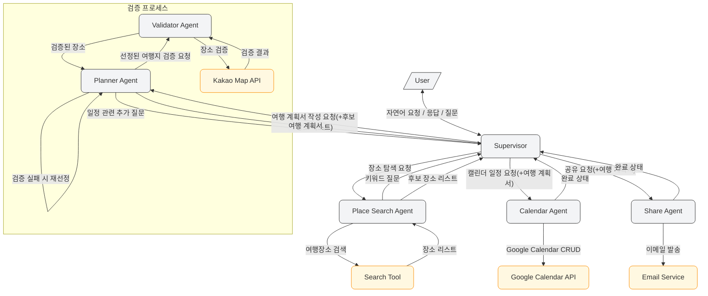
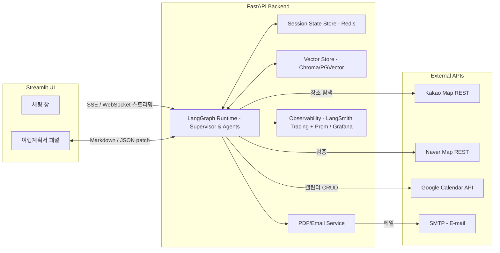

# Agent Architecture

### 핵심 동작 흐름

**사용자 요청→Supervisor**

- 사용자는 자연어로 "여행지를 추천해줘", "일정을 만들어줘" 같은 요청을 보냅니다.
- Supervisor(create_supervisor 기반 LLM + 라우팅 로직)은 사용자의 의도를 분류한 뒤, 호출해야 할 하나의 에이전트와 전달할 파라미터(JSON)를 결정합니다.
- 실패하거나 애매할 경우 "추가 질문"을 만들어 사용자에게 되묻습니다.

**장소 탐색 및 검증 단계 – Place Search Agent**

- 사용자가 여행 장소의 검색을 요청하면 Supervisor는 Place Search Agent를 호출합니다.

- 여행지 검색에 필요한 키워드를 사용자에게 추가 질문을 통해 되묻습니다.

- 사용자가 입력한 키워드를 통해 여행장소를 검색합니다. (Tool 사용)

- Supervisor는 요약된 여행정보를 사용자에게 전달합니다.

- >  Google Place API(운영시간) + Kakao Local API로 후보 장소 리스트(JSON)를 반환 - [참고](https://developers.kakao.com/docs/latest/ko/local/dev-guide#search-by-keyword) 이름, 주소, place_url, 카테고리명, 전화번호

**여행 계획서 작성 및 검증 단계 – Planner Agent → Validator Agent**

- 사용자가 일정표(여행 계획서) 작성을 요청하면 Supervisor는 Planner Agent를 호출합니다.
- 계획서 작성을 위한 정보(일정-며칠부터 며칠까지, 차 여부)를 사용자에게 추가 질문을 통해 되묻습니다. 
- 후보 장소리스트를 통해 일정 계획서에 올릴 여행지를 선정합니다
- 오픈시간을 고려하여 일자별 타임라인을 생성하여 여행계획서를 작성합니다. (날씨고려?) . (w/ Google Place API)
- supervisor는 planner Agent로부터 여행계획서를 받아서 Validator Agent를 통해 검증을 실행합니다. (상호명, 주소 존재 여부 검증)
- 검증에 성공한 경우, 검증된 여행계획서를 supervisor agent에게 전달합니다.
- 검증에 실패한 경우 수정된 여행지에 대한 정보로 다시 planner Agent에게 전달해서 planner agent는 여행계획서를 다시 작성합니다.
- agent가 작업이 완료되면, Supervisor는 여행계획서 완료가 되었다고 채팅에 알리고, 화면 우측에 여행계획서에 데이터를 전송합니다. 

**캘린더 일정 생성 단계 - Calendar Agent**

- 사용자가 여행 일정을 캘린더에 반영해달라고 요청하면, Supervisor는 Calendar Agent를 호출합니다.
- 여행계획서를 통해 Google Calendar API를 통해 CRUD를 합니다.
- agent의 작업 완료 후, supervisor는 성공·실패 상태를 사용자에게 전달합니다.

**여행 계획서 공유 단계 - Share Agent**

- 사용자가 여행 계획서를 공유를 요청하면,  Supervisor는 Share Agent를 호출합니다.
- 사용자의 이메일로 여행계획서를 전송합니다.

# System Architecture

---

어려운점

- 각 agent에 checkpointer를 두고, 대화를 이어나갔을 때, 사용자가 처음에 입력한 장소정보, agent를 통해 찾은 여행지 장소들에 대한 정보를 자꾸 까먹고 다시 물어보는 문제 발생
  - 여행장소, 여행일정, 여행지 등 고정정보는 보관해야함
  - => InMemoryStore를 활용해 agents에서 조회, 저장할 수 있도록 개선
- 다시발생한 문제-> supervisor에서 여행기본정보를 save하는 역할을 같이했으나, 잘 되지 않음

#### 📍 Day 1 - 6월 10일 (화)

| 시간  | 활동 내용            | 위치                                                     |
| ----- | -------------------- | -------------------------------------------------------- |
| 9:00  | 아침식사             | [바다마루전복죽](http://place.map.kakao.com/8379689)     |
| 10:00 | 카페에서 휴식        | [웨이브온 커피](http://place.map.kakao.com/528293263)    |
| 12:00 | 점심식사             | [기장국보미역 본점](http://place.map.kakao.com/26599991) |
| 14:00 | 해운대 해수욕장 방문 | [해운대 해수욕장](https://place.map.kakao.com/7913306)   |
| 19:00 | 저녁식사             | [해운대암소갈비집](https://place.map.kakao.com/8149130)  |
| 21:00 | 숙소 복귀 및 휴식    | [롯데호텔 부산](https://place.map.kakao.com/7862727)     |