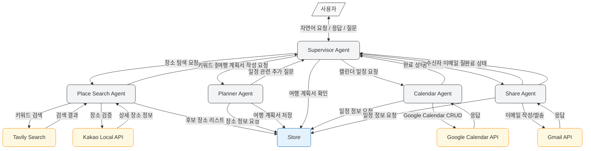

# Agent Architecture

### 핵심 동작 흐름

**사용자 요청→Supervisor**

- 사용자는 자연어로 "여행지를 추천해줘", "일정을 만들어줘" 같은 요청을 보냅니다.
- Supervisor Agent는 사용자 의도를 파악하고 하위의 적절한 전문 에이전트를 호출합니다.
- 각 에이전트가 필요한 추가 정보가 있으면 사용자에게 질문을 합니다.
- 여행의 기본 정보(지역, 여행일정)은 Store에 저장합니다.

**장소 탐색 및 검증 단계 – Place Search Agent**

- Tavily Search를 통해 키워드를 통해 여행 정보 검색을 먼저 진행합니다.
- 검색된 장소의 상세 정보와 검증을 위해 Kakao 로컬 API를 사용하여 장소를 다시 검색하고, 상세 정보들을 보충합니다. (상세URL, 주소, 위도경도 등)
- 검색된 장소 정보는 Store에 저장됩니다.

**여행 계획서 작성 및 검증 단계 – Planner Agent**

- 사용자가 일정표(여행 계획서) 작성을 요청하면 Supervisor는 Planner Agent를 호출합니다.
- 계획서 작성을 위한 정보를 사용자에게 추가 질문을 통해 되묻습니다. (여행일정)
- Store를 통해 장소 정보와 여행일정을 받아, 형식에 맞게 일정표를 작성합니다.
- 여행계획서가 완성되면 Store에 저장합니다.

**캘린더 일정 생성 단계 - Calendar Agent**

- 사용자가 여행 일정을 캘린더에 반영해달라고 요청하면, Supervisor는 Calendar Agent를 호출합니다.
- Store에 저장된 여행계획서를 통해 Google Calendar API를 통해 CRUD를 합니다.
- agent의 작업 완료 후, supervisor는 성공·실패 상태를 사용자에게 전달합니다.

**여행 계획서 공유 단계 - Share Agent**

- 사용자가 여행 계획서를 공유를 요청하면,  Supervisor는 Share Agent를 호출합니다.
- 받는 사람의 이메일을 추가 질문을 통해 되묻습니다.
- Store에 저장된 여행계획서를 통해 이메일 형식으로 formatting한 후, 사용자의 이메일로 여행계획서를 전송합니다.

